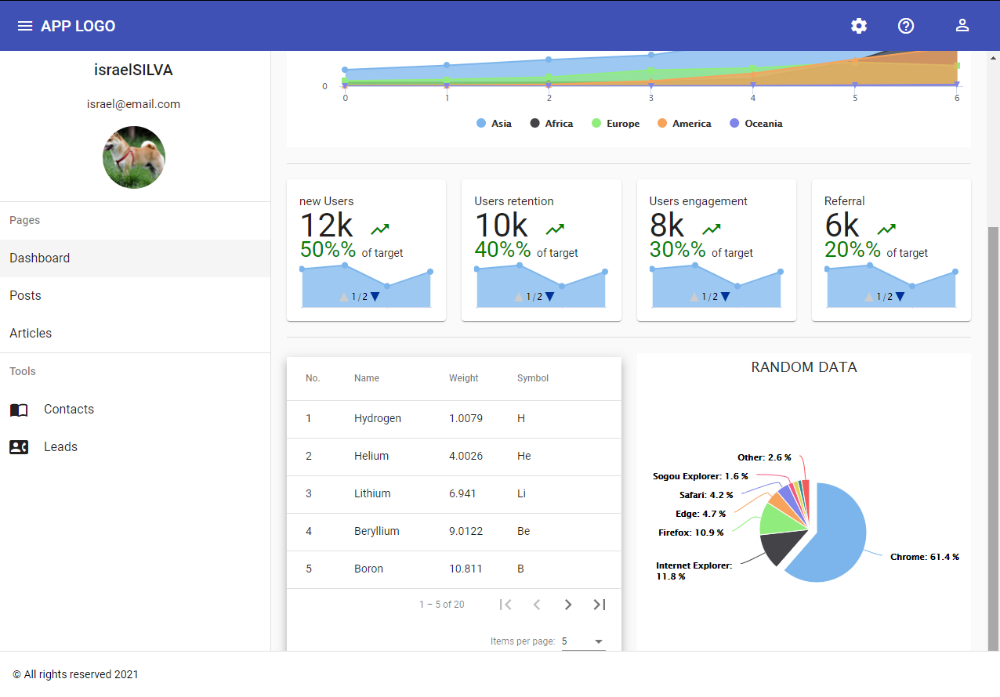

<h1 align="center">
  
</h1>

<p align="center">
  <a href="#technologies">Technologies</a>&nbsp;&nbsp;&nbsp;|&nbsp;&nbsp;&nbsp;
  <a href="#-layout">Getting started</a>&nbsp;&nbsp;&nbsp;|&nbsp;&nbsp;&nbsp;
  <a href="#-project">Project</a>&nbsp;&nbsp;&nbsp;|&nbsp;&nbsp;&nbsp;
  <a href="#-license">License</a>
</p>

<p align="center">

  [](https://github.com/israel206)
  [](#)
  
  
  
  
</p>

<br>

<p align="center">
  
</p>

---

## 🚀 Technologies

This project was developed using the following technologies:

This project was generated with [Angular CLI](https://github.com/angular/angular-cli) version 9.1.7.

- [Angular](https://angular.io/)
- [Html5](https://www.w3schools.com/html/default.asp)
- [Scss](https://sass-lang.com/)
- [TypeScript](https://www.typescriptlang.org/)

## 👨‍💻 Computer: How to run

Clone the project and access the folder

  ```bash
    # clone repository
    $ git clone https://github.com/israel206/Dashboard-grafico.git
  ```

---

## 🚀 Getting started

### Development server

Run `ng serve` for a dev server. Navigate to `http://localhost:4200/`. The app will automatically reload if you change any of the source files.

### Code scaffolding

Run `ng generate component component-name` to generate a new component. You can also use `ng generate directive|pipe|service|class|guard|interface|enum|module`.

### Build

Run `ng build` to build the project. The build artifacts will be stored in the `dist/` directory. Use the `--prod` flag for a production build.

### Running unit tests

Run `ng test` to execute the unit tests via [Karma](https://karma-runner.github.io).

### Running end-to-end tests

Run `ng e2e` to execute the end-to-end tests via [Protractor](http://www.protractortest.org/).

### Further help

To get more help on the Angular CLI use `ng help` or go check out the [Angular CLI README](https://github.com/angular/angular-cli/blob/master/README.md).

---

## 💻 Project

Project developing for academic purposes

---

## 📝 License

This project is licensed under the MIT License. See the [LICENSE](LICENSE.md) file for details.

---

Made with 💜 [by Israel Silva](https://israel206.github.io/) 👋

[ts]: https://www.typescriptlang.org
[vscode]: https://code.visualstudio.com/
[yarn]: https://yarnpkg.com/
[vceditconfig]: https://marketplace.visualstudio.com/items?itemName=EditorConfig.EditorConfig
[vceslint]: https://marketplace.visualstudio.com/items?itemName=dbaeumer.vscode-eslint
